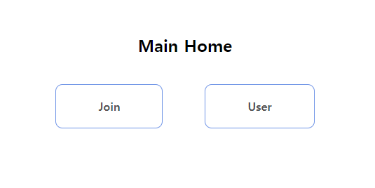
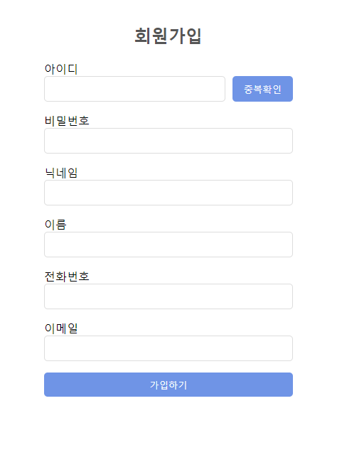
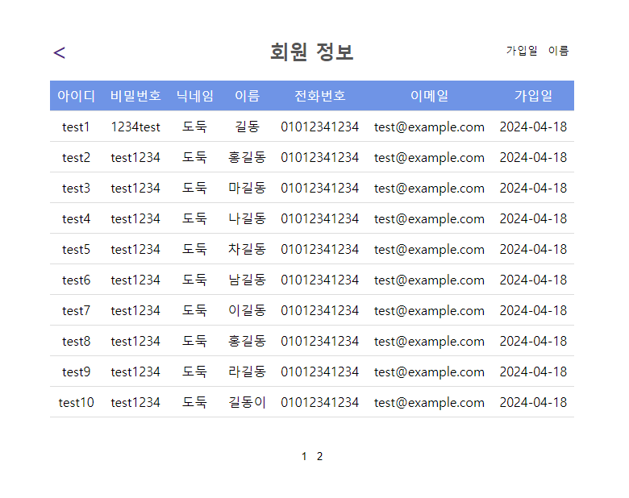
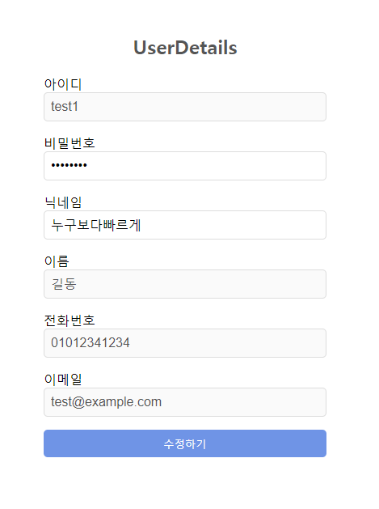

## 👋🏻 User Toy
과제 진행 : 회원가입, 회원 조회 및 페이징, 수정

Spring boot + React로 진행하였습니다.

## 🪛 Skill
&nbsp;
&nbsp;

## 📚 API 문서 및 테스트(POSTMAN)
https://documenter.getpostman.com/view/33421154/2sA3BkdZ1c

## 🖥️ 화면구성 및 기능
<table>
  <thead>
    <tr>
      <th style="text-align: center;">메인페이지</th>
    </tr>
  </thead>
  <tbody>
    <tr>
      <td align="center">
          
      </td>
    </tr>
  </tbody>
</table>

- join : 회원가입
- User : 회원조회 및 페이징, 정렬

 
<table>
  <thead>
    <tr>
      <th style="text-align: center;">회원가입</th>
      <th style="text-align: center;">회원조회 및 페이징, 정렬</th>
      <th style="text-align: center;">회원상세, 수정</th>
    </tr>
  </thead>
  <tbody>
    <tr>
      <td align="center">
        
      </td>
      <td align="center">
        
      </td>
      <td align="center">
        
      </td>
    </tr>
  </tbody>
</table>

- 회원가입 : 비밀번호 8자 이상 && 숫자 포함, 이름은 한글, 중복확인 필수
- 회원조회 및 페이징, 정렬 : 모든 회원 정보 조회, 가입일/이름으로 정렬, 수정하고 싶은 user click -> 회원 상세 페이지로 이동
- 회원상세, 수정 : ID값으로 회원 조회, 닉네임과 비밀번호 수정가능(변경사항이 없다면 수정X)
